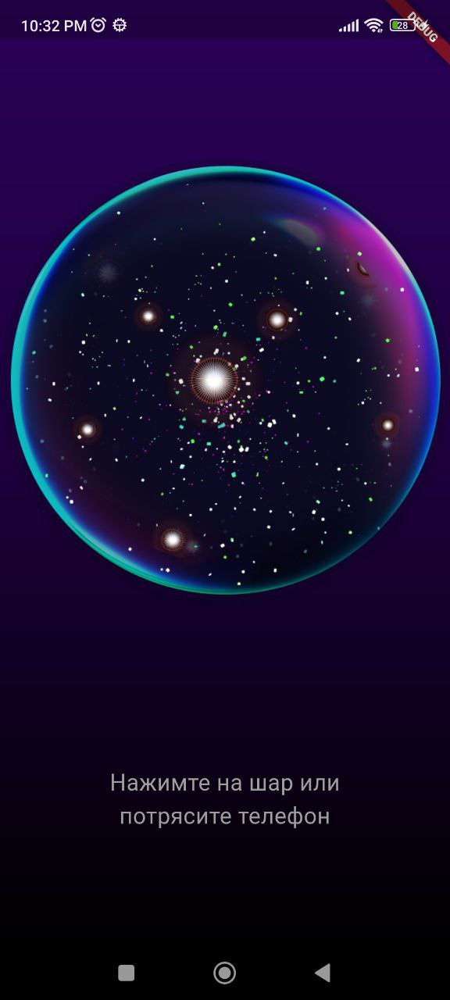
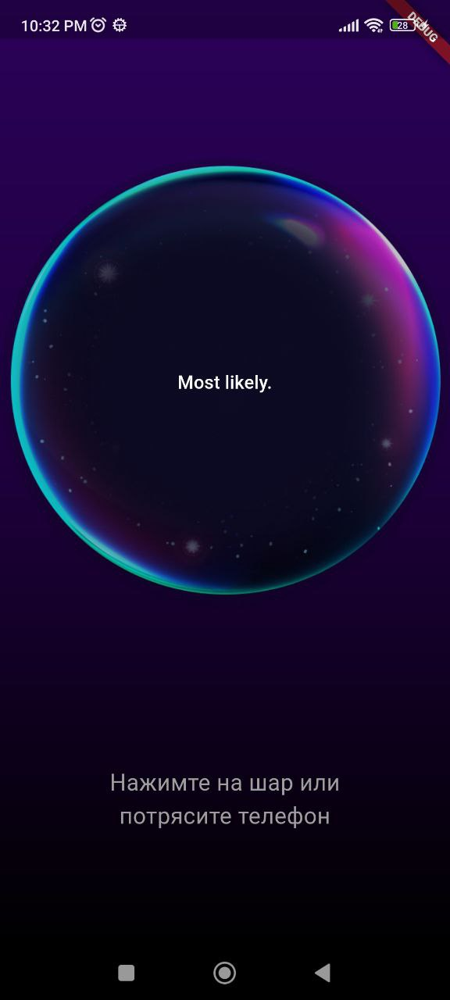
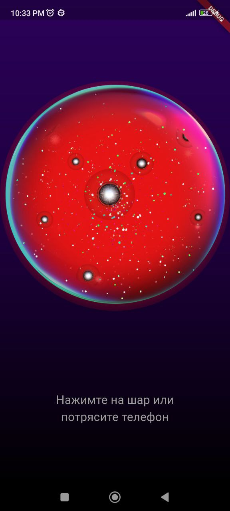

# Целевая платформа
    Android,
    Была попытка сделать адаптивность, но не успел
# Результаты
Реализовниан нтерфейс экрана с магическим шаром только темная тема.
Добавлена логика для обработки пользовательского вопроса и получения ответа от API с помощю provider.
Реализовона отправка запроса при тряске телефона.

# Ссылки на демонстрацию работы/скриншоты

    

    

    

 
   